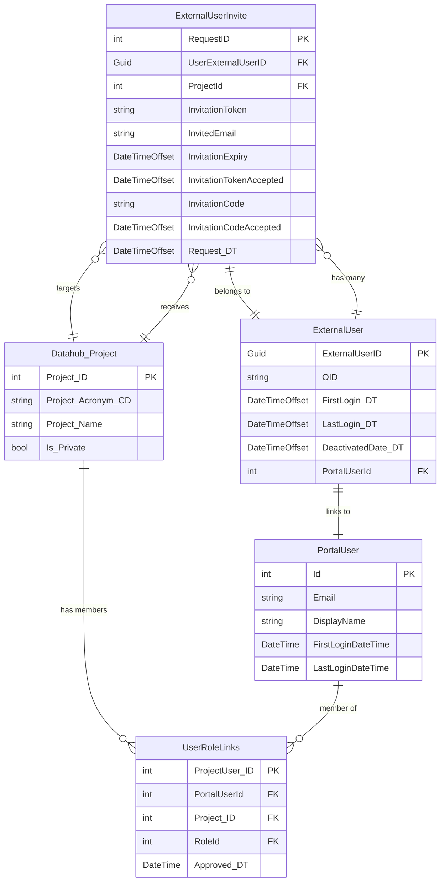

# ExternalUserInvite Table Schema and Design Rationale

## Overview

The `ExternalUserInvite` entity represents an invitation request for an external (non-GC) user to join a DataHub workspace. This table tracks the complete invitation lifecycle, including both the initial email-based invitation token and the secondary invitation code verification process. Each invite is associated with both an external user identity and a specific workspace (project).

## Column Specifications

| Column Name | Data Type | Nullable | Required | Primary Key | Purpose | Design Rationale |
|---|---|---|---|---|---|---|
| `RequestID` | int | No | Yes | ? | Unique identifier for the invite request | Standard auto-incrementing primary key for entity identification and database relationships. Enables tracking of individual invitation attempts |
| `User` | ExternalUser | No | Yes | | Navigation to the related external user | Required navigation establishing the relationship to the `ExternalUser` being invited. Supports cascade delete - when external user is removed, associated invites are also deleted |
| `Project` | Datahub_Project | No | Yes | | Navigation to the target workspace | Required navigation establishing which workspace the user is being invited to. Supports cascade delete - when project is deleted, associated invites are removed |
| `InvitationToken` | string | No | Yes | | Microsoft Graph invitation token | Stores the unique token generated by Microsoft Graph API when creating an external user invitation. Used for initial email-based verification. Empty string default ensures non-null constraint |
| `InvitedEmail` | string | No | Yes | | Email address of invited user | The email address to which the invitation was sent. Critical for matching the invitation to the user and for resending invitations if needed |
| `InvitationExpiry` | DateTimeOffset | No | Yes | | Token expiration timestamp | Tracks when the invitation token expires. Enables cleanup of stale invitations and determines when a new invitation must be sent. Uses DateTimeOffset for timezone-aware comparisons |
| `InvitationTokenAccepted` | DateTimeOffset? | Yes | No | | Timestamp when token was accepted | Nullable field tracking when the user clicked the email invitation link and accepted the token. Null indicates the token has not yet been accepted. Critical for tracking invitation flow progress |
| `InvitationCode` | string | No | Yes | | Secondary verification code | A secondary code (typically shorter/simpler) provided to the user for additional verification. This dual-verification approach enhances security and provides a backup verification method. Empty string default |
| `InvitationCodeAccepted` | DateTimeOffset? | Yes | No | | Timestamp when code was accepted | Nullable field tracking when the user successfully entered and verified the invitation code. Null indicates code verification is pending. Completes the dual-verification workflow |
| `Request_DT` | DateTimeOffset | No | Yes | | Invitation request creation timestamp | Records when the invitation was initially created. Essential for audit logging, tracking invitation age, and determining if re-invitation is needed. Stored as datetimeoffset in database |

## Entity Relationship Diagram



## Design Patterns

### Dual-Verification Invitation Flow
The invitation system implements a two-step verification process:
1. **Token-based verification** (`InvitationToken` + `InvitationExpiry`): Primary verification via email link containing Microsoft Graph-generated token
2. **Code-based verification** (`InvitationCode`): Secondary verification requiring user to enter a code, providing additional security

This dual approach provides:
- **Security**: Multiple verification factors reduce unauthorized access risk
- **Flexibility**: If email link fails, users can manually enter the invitation code
- **Auditability**: Separate acceptance timestamps track each verification step

### Nullable Acceptance Timestamps
Both `InvitationTokenAccepted` and `InvitationCodeAccepted` are nullable (`DateTimeOffset?`) to represent invitation lifecycle states:
- **Both null**: Invitation sent but not yet acted upon
- **Token accepted, code null**: User clicked email link but hasn't entered code
- **Both populated**: Full verification complete, user can access workspace
- **Expiry tracking**: Compare against `InvitationExpiry` to determine if re-invitation needed

### Workspace-User Association
The invite links three entities:
- **ExternalUser**: The identity being invited (may already exist or be created)
- **Project**: The specific workspace they're being invited to join
- **Invitation metadata**: The verification tokens and timestamps

This design enables:
- **Targeted invitations**: Each invite is workspace-specific
- **Re-invitation**: Same user can be invited to multiple workspaces
- **Invitation history**: Track all invitation attempts per user per workspace

### Timezone-Aware Timestamps
All temporal fields use `DateTimeOffset` (not `DateTime`) to ensure:
- **Global compatibility**: Invitations work correctly across timezones
- **Accurate expiry**: Token expiration is compared against consistent UTC time
- **Audit clarity**: Timestamps reflect exact moment of action regardless of server location

## Entity Framework Configuration

The `ExternalUserInviteConfiguration` class defines:
- **Table name**: "ExternalUserInvites"
- **Primary key**: `RequestID` with auto-increment
- **Relationships**:
  - **User**: Required one-to-many with `ExternalUser` (cascade delete)
  - **Project**: Required many-to-one with `Datahub_Project` (cascade delete)
- **Special conversions**: `Request_DT` explicitly mapped to "datetimeoffset" column type

## Invitation Workflow

### 1. Invitation Creation
```
Workspace Admin ? Invite External User
    ?
Portal creates ExternalUser record (if needed)
    ?
Portal calls Graph API to create invitation
    ?
ExternalUserInvite record created with:
    - InvitationToken (from Graph API)
    - InvitationCode (generated by portal)
    - InvitationExpiry (calculated from creation time)
    - Request_DT (current timestamp)
```

### 2. Token Verification (Email Link)
```
User clicks email invitation link
    ?
Portal validates InvitationToken
    ?
Check: InvitationExpiry > CurrentTime
    ?
If valid: Update InvitationTokenAccepted
    ?
Redirect to code entry page
```

### 3. Code Verification
```
User enters InvitationCode
    ?
Portal validates code against record
    ?
If valid: Update InvitationCodeAccepted
    ?
Add user to workspace with appropriate role
    ?
User gains access to project resources
```

## Usage Scenarios

1. **Invite External User to Workspace**
   - Admin specifies email and target project
   - System creates/locates ExternalUser record
   - Graph API generates invitation token
   - System generates invitation code
   - Email sent with both token link and code

2. **Track Invitation Status**
   - Query `InvitationTokenAccepted` and `InvitationCodeAccepted`
   - Determine which step user is on
   - Resend email if both null and approaching expiry

3. **Handle Expired Invitations**
   - Compare `InvitationExpiry` with current time
   - If expired and not accepted, create new invitation
   - Archive or delete old invitation record

4. **Re-invite User**
   - User can be invited multiple times to same project
   - Each invitation gets unique tokens and codes
   - Most recent valid invitation is used for verification

5. **Audit Invitation History**
   - Query all ExternalUserInvite records for a user
   - Review `Request_DT`, acceptance timestamps
   - Track which workspaces user was invited to
   - Identify invitation patterns and delays

## Security Considerations

### Token Security
- **Expiration**: Tokens have limited lifetime (`InvitationExpiry`)
- **Single-use**: Once accepted, token should be invalidated
- **Unique per invite**: Each invitation gets unique token
- **Generated by Microsoft Graph**: Leverages Microsoft's security infrastructure

### Code Security
- **Secondary verification**: Provides additional security layer
- **Simple format**: Easier for users to enter manually
- **Paired with token**: Both verifications required for full access
- **Time-bounded**: Subject to same expiration as token

### Data Protection
- **Email storage**: Invited email stored for audit but not used as primary identifier
- **Cascade deletion**: When ExternalUser deleted, invitations are removed
- **Project isolation**: Each invitation is project-specific, limiting scope

## Integration Points

### Microsoft Graph API
- **Invitation creation**: `CreateGraphUser` function sends invitation via Graph API
- **Token generation**: Graph API returns `InvitationToken`
- **Email delivery**: Microsoft handles sending invitation email
- **Redirect URL**: Configured to return users to DataHub portal

### ExternalUser Relationship
- **One-to-many**: Each ExternalUser can have multiple invitations (different projects)
- **Cascade delete**: Removing ExternalUser removes associated invitations
- **Navigation property**: `Invitations` collection on ExternalUser
- **Tracked invitations**: Complete history of invitation attempts

### Project Relationship
- **Many-to-one**: Multiple invitations can target same project
- **Cascade delete**: Removing project removes associated invitations
- **Access control**: Invitation determines initial role assignment
- **Workspace context**: Invitation is workspace-specific

## Comparison with Related Entities

### vs. ExternalUser
- **ExternalUser**: Represents the user identity and login history
- **ExternalUserInvite**: Represents the invitation process and verification
- **Relationship**: User can have multiple invites (one per workspace invitation)

### vs. UserRoleLinks
- **UserRoleLinks**: Represents current workspace membership and role
- **ExternalUserInvite**: Represents pending invitation before membership
- **Flow**: Invitation acceptance triggers creation of UserRoleLinks record

### vs. SelfRegistrationDetails
- **SelfRegistrationDetails**: For internal users self-registering to portal
- **ExternalUserInvite**: For external users invited to specific workspace
- **Difference**: SelfRegistration is portal-wide; Invite is project-specific

## Data Retention and Cleanup

### Active Invitations
- Retain until accepted or expired
- Enable resending if user lost email
- Support audit queries for pending invitations

### Expired Invitations
- Can be archived after expiration + grace period
- Historical value for audit and analytics
- Consider cleanup jobs for very old expired invitations

### Accepted Invitations
- Retain for audit trail
- Link invitation history to user access grants
- Support compliance requirements for access reviews

---

## Best Practices for Implementation

1. **Always check expiration**: Before validating tokens, verify `InvitationExpiry > DateTime.UtcNow`
2. **Handle expired gracefully**: Provide clear UI for requesting new invitation
3. **Track both verifications**: Don't grant access until both `InvitationTokenAccepted` and `InvitationCodeAccepted` are set
4. **Generate unique codes**: Ensure invitation codes are unique and sufficiently random
5. **Set reasonable expiry**: Balance security (shorter) vs. user convenience (longer)
6. **Log all attempts**: Track verification attempts for security monitoring
7. **Support re-invitation**: Allow admins to send new invitations if previous ones expired
8. **Clean up regularly**: Implement scheduled jobs to remove very old, expired invitations

## Migration Notes

The `ExternalUserInvite` entity was introduced to support:
- External user invitation workflow
- Dual-verification security model
- Project-specific access invitations
- Integration with Microsoft Graph invitation API

When migrating existing systems:
- Existing external users may not have associated invitation records
- Historical invitations may need to be reconstructed from audit logs
- Consider migration script to populate invitation history if available
