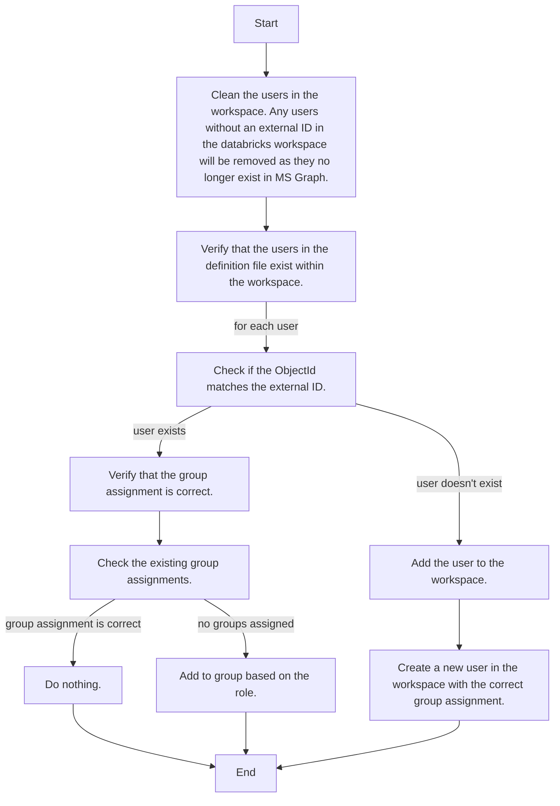

# Resource Provisioner Python Functions

## Overview

This project contains the Python functions for the Resource Provisioner. The functions are deployed to Azure Functions and are triggered by events from the Storage Queue.

## SynchronizeWorkspaceUsers

This function is triggered by a message in the Storage Queue. The message contains the workspace definition file with the list of users and their roles. The function will synchronize the users and their roles with the workspace.

