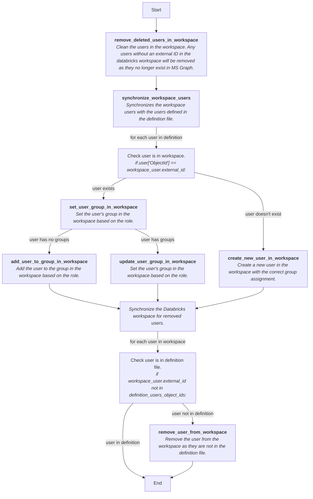

# Resource Provisioner Python Functions

## Prerequisites

Before running the functions locally, you need to install the Azure Functions Core Tools and Poetry.

On Windows, you can use `winget`:

```powershell
winget install Python.Python.3.12
winget install Python.Poetry
winget install Microsoft.Azure.FunctionsCoreTools
```

On Linux, install the prerequisites and Azure Functions Core Tools with the package manager:

```bash
curl https://packages.microsoft.com/keys/microsoft.asc | gpg --dearmor > microsoft.gpg
sudo install -o root -g root -m 644 microsoft.gpg /etc/apt/trusted.gpg.d/
sudo sh -c 'echo "deb [arch=amd64] https://packages.microsoft.com/repos/azure-cli/ $(lsb_release -cs) main" > /etc/apt/sources.list.d/azure-cli.list'
sudo apt-get update
sudo apt-get install -y azure-functions-core-tools-4
```

If `poetry` is not already installed on Linux, install it with:

```bash
curl -sSL https://install.python-poetry.org | python3 -
```

Install the project dependencies with Poetry:

```powershell
poetry install
```

Install Azure Functions Core Tools separately if the `func` command is not available:

```powershell
winget install Microsoft.Azure.FunctionsCoreTools
```

To run the function app locally, start the host from the project directory:

```powershell
func start --python
```

> Note: `poetry run` is only for Python packages in the Poetry environment. The `func` command comes from Azure Functions Core Tools and must be installed independently.

## Overview

This project contains the Python functions for the Resource Provisioner. The functions are deployed to Azure Functions and are triggered by events from the Storage Queue.

In order for the functions to run, the following configuration variables must be set in your `local.settings.json`

```json
{
  "IsEncrypted": false,
  "Values": {
    "FUNCTIONS_WORKER_RUNTIME": "python",
    "AzureWebJobsAzureStorageQueueConnectionString": "<azurite_storage_connection_string>",
    "AzureWebJobsStorage": "UseDevelopmentStorage=true"
  }
}
```

Or you can run the following commands to set the environment variables:

```pwsh
$env:AzureClientId = (az keyvault secret show --name "devops-client-id" --vault-name "fsdh-key-dev" --query value -o tsv)
$env:AzureClientSecret = (az keyvault secret show --name "devops-client-secret" --vault-name "fsdh-key-dev" --query value -o tsv)
$env:AzureTenantId = "8c1a4d93-d828-4d0e-9303-fd3bd611c822"
```

To launch the functions locally, you can use the following command:

```pwsh
func start --python
```

> Note: The functions will not run locally without the required environment variables set and azurite running.

## SynchronizeWorkspaceUsersHttpTrigger

This function is triggered by a message in the Storage Queue. The message contains the workspace definition file with the list of users and their roles. The function will synchronize the users and their roles with the workspace.



```mermaid
flowchart
    Start --> Clean["`
    **remove_deleted_users_in_workspace**
    *Clean the users in the workspace. Any users without an external ID in the databricks workspace will be removed as they no longer exist in MS Graph.*
    `"]

    Clean --> Sync["`
    **synchronize_workspace_users**
    *Synchronizes the workspace users with the users defined in the definition file.*
    `"]
    Sync -->|for each user in definition| Exists["`
    Check user is in workspace.
    *if user['ObjectId'] == workspace_user.external_id:*
    `"]
    
    Exists-->|user exists| SetGroup["`
    **set_user_group_in_workspace**
    *Set the user's group in the workspace based on the role.*
    `"]
    Exists-->|user doesn't exist| Add["`
    **create_new_user_in_workspace**
    *Create a new user in the workspace with the correct group assignment.*
    `"]

    SetGroup --> |user has no groups| AddGroup["`
    **add_user_to_group_in_workspace**
    *Add the user to the group in the workspace based on the role.*
    `"]
    SetGroup --> |user has groups| UpdateGroups["`
    **update_user_group_in_workspace**
    *Set the user's group in the workspace based on the role.*
    `"]

    AddGroup --> Empty["`*Synchronize the Databricks workspace for removed users.*`"]
    UpdateGroups --> Empty
    Add --> Empty

    Empty --> |for each user in workspace| CheckDef["`
    Check user is in definition file.
    *if workspace_user.external_id not in definition_users_object_ids:*
    `"]

    CheckDef -->|user not in definition| Remove["`
    **remove_user_from_workspace**
    *Remove the user from the workspace as they are not in the definition file.*
    `"]

    CheckDef -->|user in definition| End
    Remove --> End
```

## Docker build

### Building docker image

```bash
docker build --tag fsdh-pyfunction:latest .
```

### Running docker image

```bash
docker run -p 8080:80 \
-e AzureClientId=$AzureClientId \
-e AzureClientId=$AzureClientId \
-e AzureClientSecret=$AzureClientSecret \
-e AzureTenantId=$AzureTenantId \
-e AzureSubscriptionId=$AzureSubscriptionId \
-e DatahubServiceBus=$DatahubServiceBus \
-e Datahub_ENVNAME=$Datahub_ENVNAME \
 fsdh-pyfunction:latest
```

```bash
docker run -p 8080:80 -e AzureClientId=$env:AzureClientId -e AzureClientId=$env:AzureClientId -e AzureClientSecret=$env:AzureClientSecret -e AzureTenantId=$env:AzureTenantId -e AzureSubscriptionId=$env:AzureSubscriptionId -e DatahubServiceBus=$env:DatahubServiceBus -e Datahub_ENVNAME=$env:Datahub_ENVNAME fsdh-pyfunction:latest
 ```

### Running docker image from ACR

```bash
docker pull fsdhacrdev.azurecr.io/fsdh/user-py:latest
```

```bash
docker run -p 8080:80 -e AzureClientId=$AzureClientId -e AzureClientId=$AzureClientId -e AzureClientSecret=$AzureClientSecret -e AzureTenantId=$AzureTenantId -e AzureSubscriptionId=$AzureSubscriptionId -e DatahubServiceBus=$DatahubServiceBus -e Datahub_ENVNAME=$Datahub_ENVNAME  fsdhacrdev.azurecr.io/fsdh/user-py:latest
```

