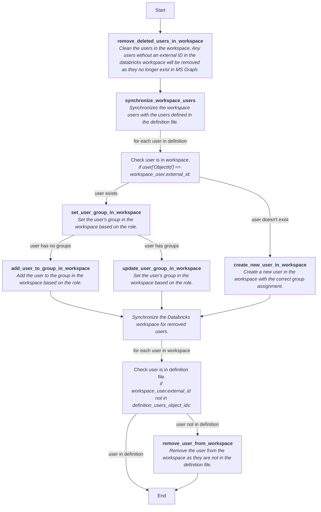

# Resource Provisioner Python Functions


## Overview

This project contains the Python functions for the Resource Provisioner. The functions are deployed to Azure Functions and are triggered by events from the Storage Queue.

In order for the functions to run, the following configuration variables must be set in your `local.settings.json`

```json
{
  "IsEncrypted": false,
  "Values": {
    "FUNCTIONS_WORKER_RUNTIME": "python",
    "AzureWebJobsAzureStorageQueueConnectionString": "<azurite_storage_connection_string>",
    "AzureWebJobsStorage": "UseDevelopmentStorage=true"
  }
}
```

Or you can run the following commands to set the environment variables:

```pwsh
$env:AzureClientId = (az keyvault secret show --name "devops-client-id" --vault-name "fsdh-key-dev" --query value -o tsv)
$env:AzureClientSecret = (az keyvault secret show --name "devops-client-secret" --vault-name "fsdh-key-dev" --query value -o tsv)
$env:AzureTenantId = "8c1a4d93-d828-4d0e-9303-fd3bd611c822"
```

To launch the functions locally, you can use the following command:

```pwsh
func start --python
```

> Note: The functions will not run locally without the required environment variables set and azurite running.


## SynchronizeWorkspaceUsersHttpTrigger

This function is triggered by a message in the Storage Queue. The message contains the workspace definition file with the list of users and their roles. The function will synchronize the users and their roles with the workspace.


