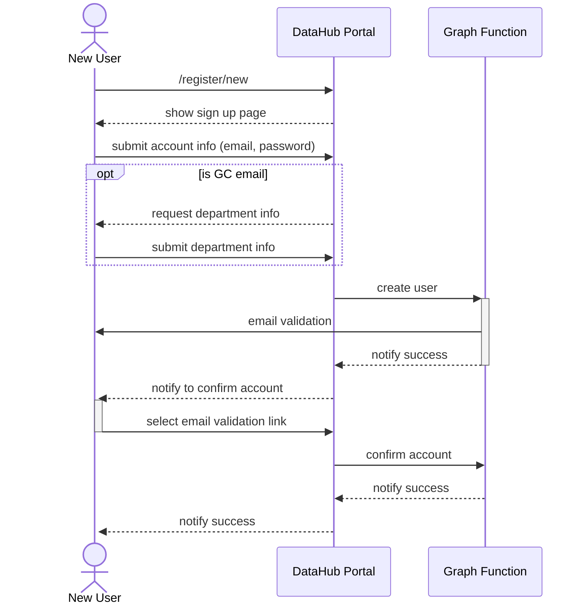
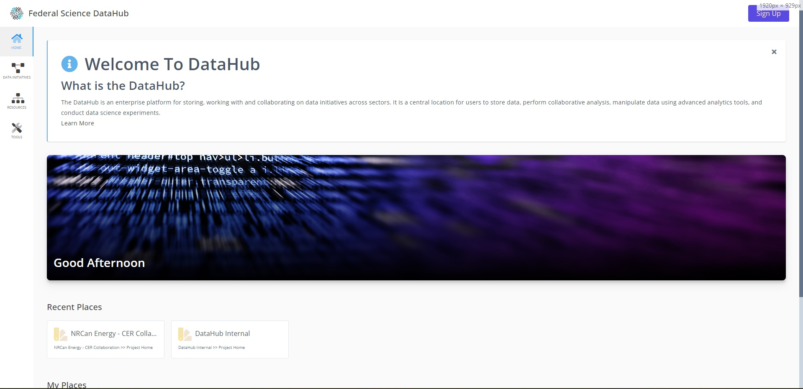
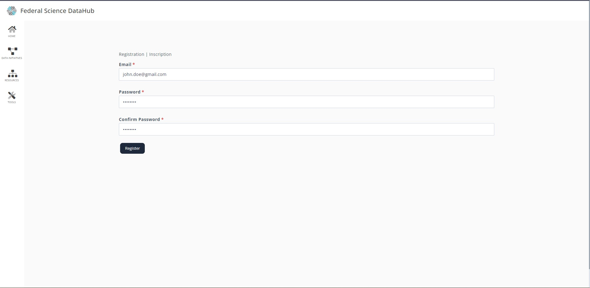
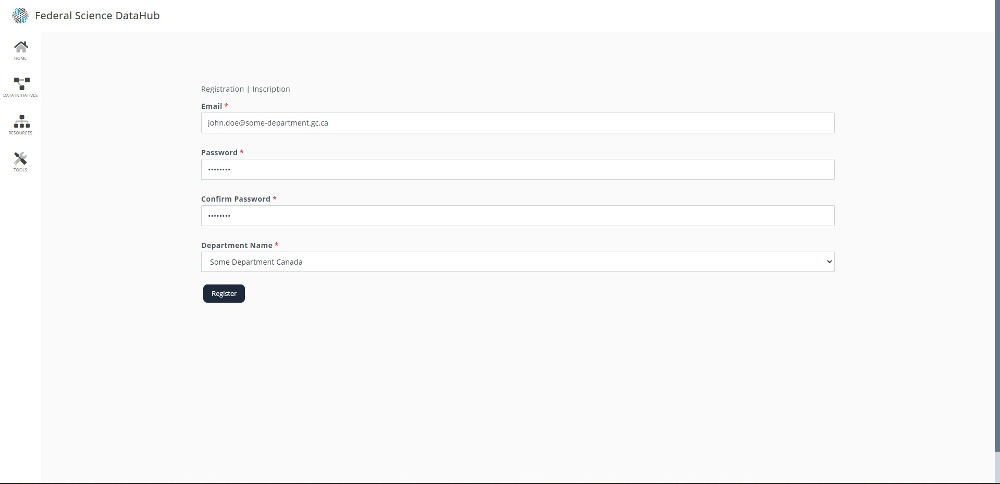
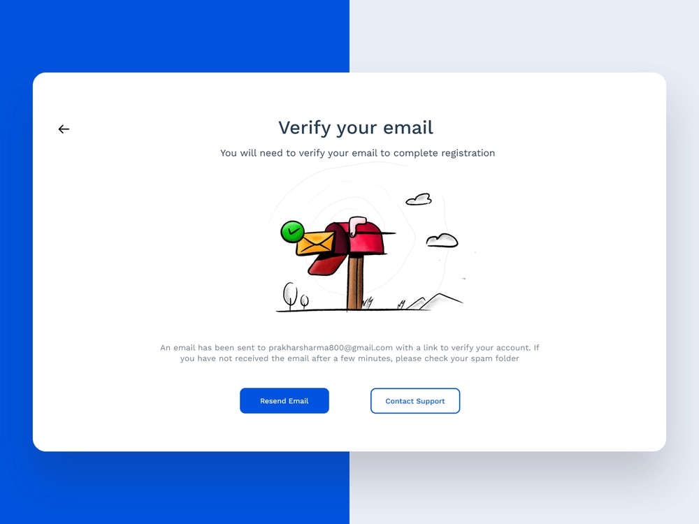
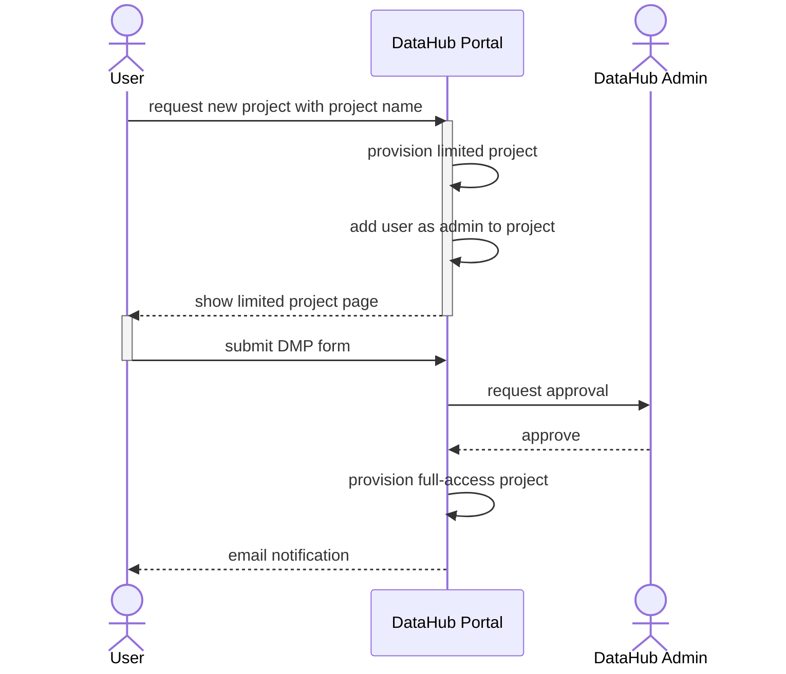
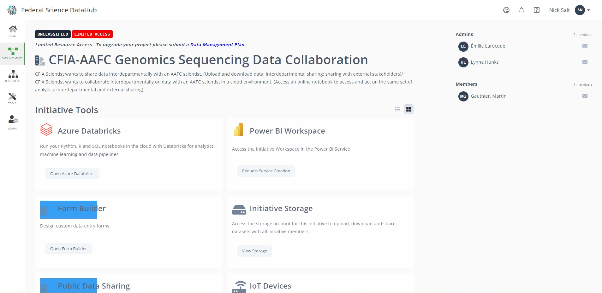
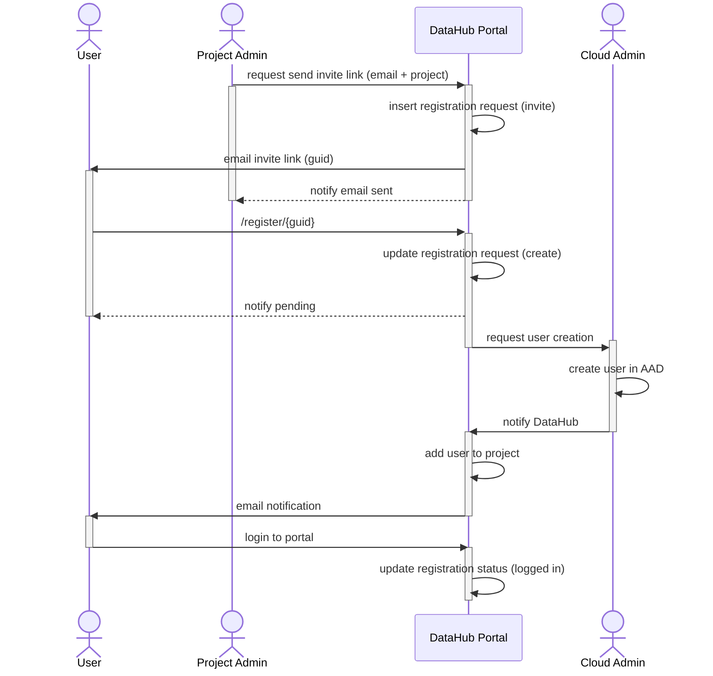
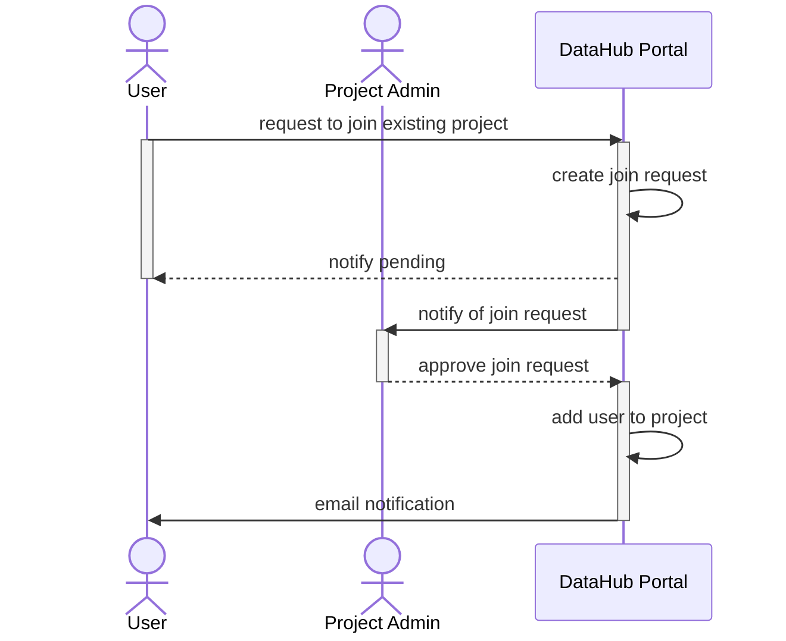

# [UC001] New User
## Sequence Diagram

## Mockups

Sign-in button appears in top right of screen

A similar user registration form is shown

If email entered is a GC email, request department

An email verification will be sent to the user

# [UC002] Project Creation (GC Users only)
As a **GC user**, I want to create a new project (Initiative)

## Sequence Diagram

## Mockups

A card for new project will be displayed, amongst an other projects the user has.

The user will be required to enter the name of the project.

Once the user fills out the name of the project, they will be required to fill out the DMP form before gaining full access.
# [UC003] New user and existing project

As a new user, I want to sign up to an existing project in DataHub

## Sequence Diagram

# [UC004] Existing user and existing project
As an existing user, I want to join an existing project in DataHub

## Sequence Diagram

