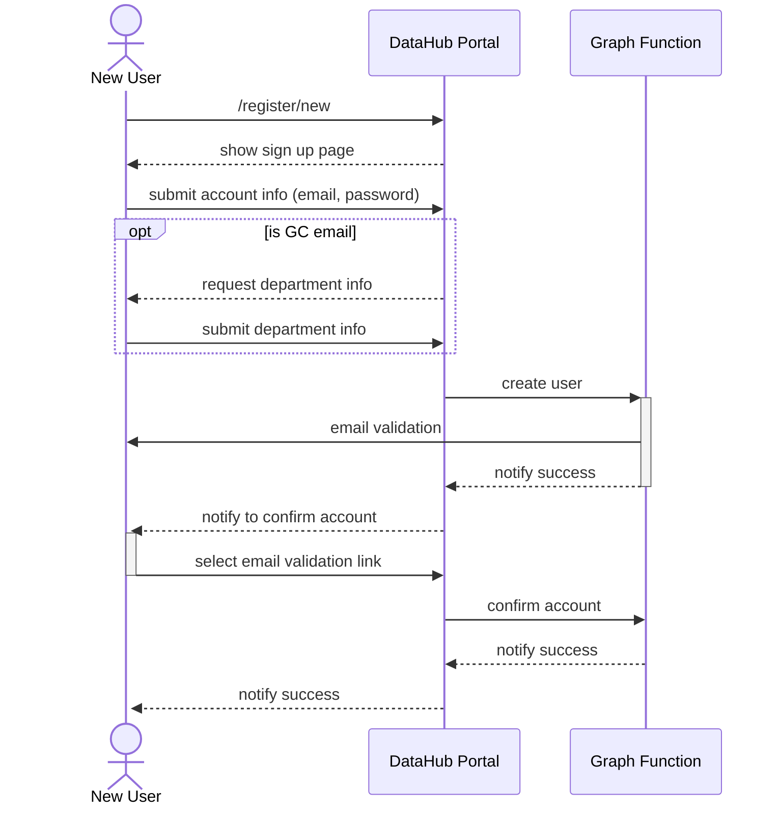
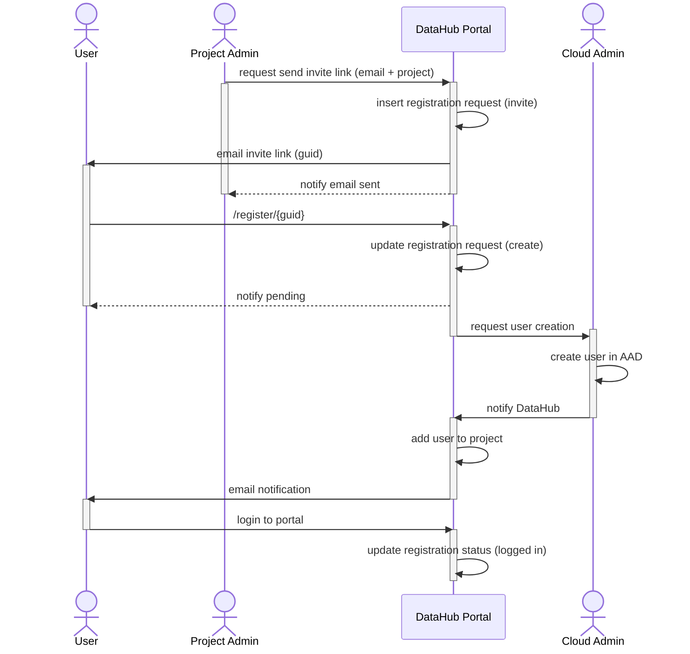
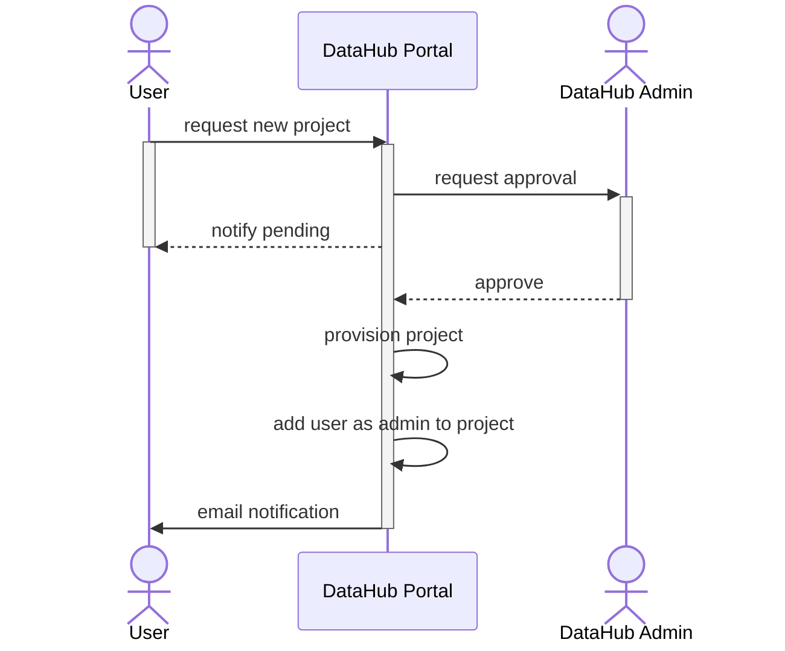
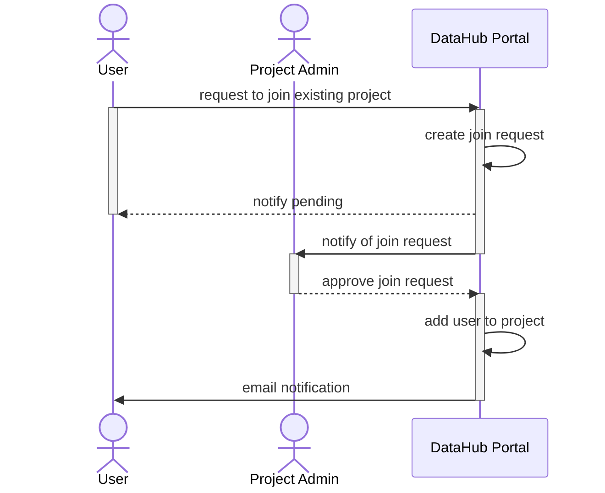
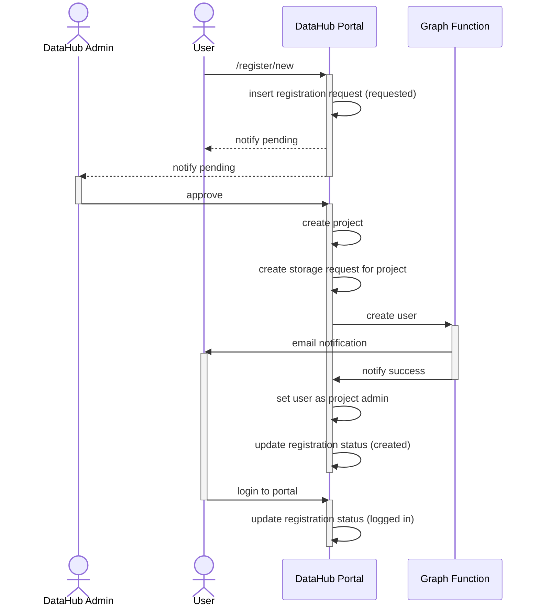

# [UC001] New user and new project

## User Creation
### Sequence Diagram

### Mockups

# [UC002] New user and existing project
As a new user, I want to sign up to an existing project in DataHub

# [UC003] Existing user and new project
As an existing user, I want to create a new project in DataHub

# [UC003] Existing user and existing project
As an existing user, I want to join an existing project in DataHub

### Old (TEMP!)
