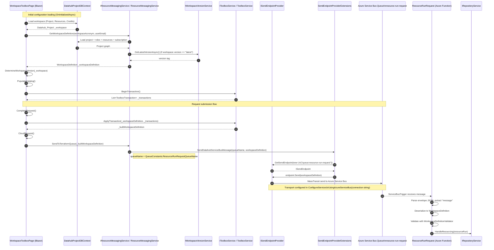

# Service Bus request flow for Toolbox provisioning

This document describes:

1. how the initial Toolbox configuration is loaded, and
2. how a Toolbox request is sent to Azure Service Bus, including the classes and objects used.

## Mermaid sequence diagram (initial load + request submission)

## Initial configuration loading details

During `WorkspaceToolboxPage.OnInitializedAsync()`:

- Creates a DB context using `IDbContextFactory<DatahubProjectDBContext>`.
- Loads workspace/project state from DB (`Projects`, `Resources`, `Credits`).
- Calls `IResourceMessagingService.GetWorkspaceDefinition(...)` to build the baseline `WorkspaceDefinition`.
- Determines workspace version (`DetermineWorkspaceVersion`) using `IWorkspaceVersionService` when needed.
- Populates available tools (`PopulateCatalog`).
- Initializes a transaction list through `IToolboxService.BeginTransaction()`.

This initial state is what later gets transformed into `_builtWorkspaceDefinition` before queue submission.

## Classes involved

- `Datahub.Portal.Pages.Workspace.Toolbox.WorkspaceToolboxPage`
  - Loads initial workspace configuration and initiates cloud request.
- `Datahub.Application.Services.IResourceMessagingService`
  - Interface used by the page to get `WorkspaceDefinition` and send queue messages.
- `Datahub.Infrastructure.Services.ResourceMessagingService`
  - Builds `WorkspaceDefinition` from DB data and sends it to Service Bus.
- `Datahub.Application.Services.Toolbox.IToolboxService`
  - Transaction API for toolbox changes.
- `Datahub.Infrastructure.Services.Toolbox.ToolboxService`
  - Applies transactions to create the final `WorkspaceDefinition`.
- `Datahub.Infrastructure.Extensions.SendEndpointProviderExtensions`
  - Resolves queue endpoint and sends message via MassTransit.
- `MassTransit.ISendEndpointProvider`
  - Provider used to obtain an `ISendEndpoint`.
- `ResourceProvisioner.Functions.ResourceRunRequest`
  - Azure Function consumer for the queue.
- `ResourceProvisioner.Application.Services.IRepositoryService`
  - Handles downstream provisioning workflow after validation.

## Main objects and payloads

- `Datahub_Project _workspace`
  - Workspace state loaded from DB for UI decisions and validation.
- `WorkspaceDefinition _workspaceDefinition`
  - Baseline definition loaded from `GetWorkspaceDefinition(...)`.
- `List<ToolboxTransaction> _transactions`
  - User-requested add/update/remove actions in Toolbox.
- `WorkspaceDefinition _builtWorkspaceDefinition`
  - Final payload built by applying transactions.
- `QueueConstants.ResourceRunRequestQueueName`
  - Queue name: `resource-run-request`.
- `ISendEndpoint` / `ISendEndpointProvider`
  - MassTransit objects used to route and send.
- `ServiceBusReceivedMessage`
  - Raw incoming message in the Azure Function.
- JSON message envelope
  - Consumer extracts `root.message` and deserializes to `WorkspaceDefinition`.

## Key code locations

- `Portal/src/Datahub.Portal/Pages/Workspace/Toolbox/WorkspaceToolboxPage.razor.cs`
  - `OnInitializedAsync()`, `CompleteRequest()`, `CloudRequest()`
- `Portal/src/Datahub.Infrastructure/Services/ResourceMessagingService.cs`
  - `GetWorkspaceDefinition(...)`, `SendToTerraformQueue(...)`
- `Portal/src/Datahub.Infrastructure/Services/Toolbox/ToolboxService.cs`
  - `BeginTransaction()`, `ApplyTransaction(...)`
- `Portal/src/Datahub.Infrastructure/Extensions/SendEndpointProviderExtensions.cs`
  - `SendDatahubServiceBusMessage(...)`
- `Portal/src/Datahub.Infrastructure/ConfigureServices.cs`
  - MassTransit + Azure Service Bus transport configuration
- `Shared/src/Datahub.Shared/Configuration/QueueConstants.cs`
  - Queue constants and queue documentation
- `ResourceProvisioner/src/ResourceProvisioner.Functions/ResourceRunRequest.cs`
  - Queue trigger, deserialize, validate, and process
